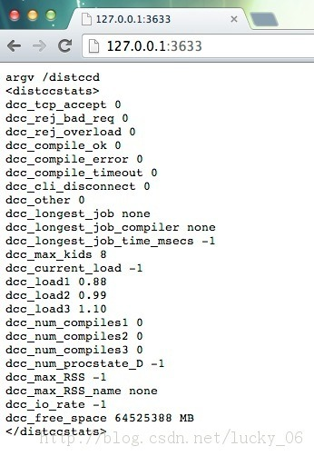

#分布式编译IOS研究

目前手Q编译过程异常缓慢，尤其是在一些性能相对较差的机器上面，简直不堪忍受。以往在解决编译过程过慢的问题的时候，我们会考虑使用分布式编译的策略。那么在XCode上使用了分布式编译的效果到底怎样呢？这里我们使用distcc处理分布式编译的任务。XCode4.2及以前版本一直在使用distcc做为分布式构建的基础组件，但是4.3之后，苹果突然删去了分布式构建的选项和对distcc的支持，开始强制要求开发者转向使用llvm进行编译。官方并没有给出任何原因，就强制到删掉了distcc的支持。现在在XCode6下面使用distcc就需要我们手工处理。

现在要想使用distcc只能自己手工处理了。

##一、distcc的安装和XCode环境配置：

安装附件中的distcc，因为打过一个patch，建议不要从官方下，直接使用附件中的版本。

解压后，通过以下命令安装

```
./configur --disable-Werror
make 
make install
```

编译distcc并且将其ln到XCode编译器目录

```
#link to xcode
sudo rm "$XcodePath/Toolchains/XcodeDefault.xctoolchain/usr/bin/distcc"
sudo ln /usr/local/bin/distcc "$XcodePath/Toolchains/XcodeDefault.xctoolchain/usr/bin/distcc"
```

通过以下命令将XCode默认编译器更换为distcc

```
cd `dirname $0`
XcodePath=`xcode-select --print-path`
cd "$XcodePath/../PlugIns/Xcode3Core.ideplugin/Contents/SharedSupport/Developer/Library/Xcode/Plug-ins/Clang LLVM 1.0.xcplugin/Contents/Resources"

sudo sed -i "_backup" "s/ExecPath = \"clang\";/ExecPath = \"distcc\";/g" "./Clang LLVM 1.0.xcspec"
##可以通过使用这句命令替换上一条命令还原默认编译器Clang  
##sudo sed -i "" "s/ExecPath = \"distcc\";/ExecPath = \"clang\";/g" "./Clang LLVM 1.0.xcspec"
```

##二、配置和使用

###服务器配置
启动服务器

```
touch distccd.log
distccd  --daemon --allow 127.0.0.1 --allow 10.64.68.102 -j 8 --stats --log-level info --log-file=distccd.log
```

--allow后面跟着允许访问该机distcc服务的IP地址，即有效client的地址。

在server启动后，可以访问其3633端口获取统计信息，如本机运行作为server后访问http://127.0.0.1:3633/ 可查看到当前统计情况



###客户端配置
1. 在~/.distcc/hosts或/usr/local/etc/distcc/hosts添加sever的服务器地址

2. 修改XCode的编译任务数量：

```
defaults write com.apple.dt.XCodeIDEBuildOperationMaxNumberOfConcurrentCompileTasks 8
```

现在可以在命令行CD到QQ主干下面通过一下命令来启动编译

```
xcodebuild -target QQ
```

在服务器端使用```./distccmon-text 5```可以实时监测编译的情况。

##三、实验数据和总结
###第一组对比数据（编译distcc源码）
1. 使用原生单机编译约5秒左右
2. 使用make CC="distcc gcc"时间为30s左右。

###第二组实验数据对比
1. xcode直接编译手Q项目，约6分钟左右。
2. 使用distcc在命令行中调用xcodebuild -target QQ编译，运行了一个小时没有编译完成，就放弃编译过程了。


所用的主机是新版的iMac（i7四核，16G内存），另外一台机器是mbp（i7双核，16G内存）。

实验所得到效果并不是很理想，原本在很多大型项目中能够提高编译效率的并发式编译在手Q这个项目中并没有取的非常理想的结果。反而与原先编译过程较慢的老版的imac相比（i5单核，8G内存），新版mac的编译性能有了明显的提高。编译过程是一个CPU密集型的任务，当初考虑并发式编译就是想通过集群的能力，来弥补单机CPN性能的不足。但是，实验的效果不是很理想。反而是单机CPU能力提高带来的编译性能提升明显。单机CPU核心数越高，编译速度越快。


中间出现的一个奇怪的现象是在使用了distcc之后编译性能不但没有提升，反而有所下降。此处存疑，后续就绪研究原因。
###参考资料：

1. [加速Linux程序编译](http://www.freemindworld.com/blog/2010/100105_make_complie_process_faster.shtml)
2. [OS X上搭建distcc使用XCode进行分布式编译](http://www.myexception.cn/operating-system/1631778.html)
