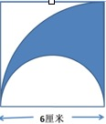
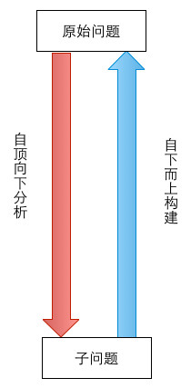
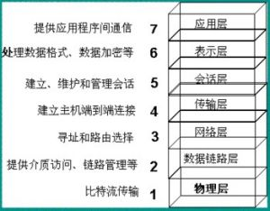
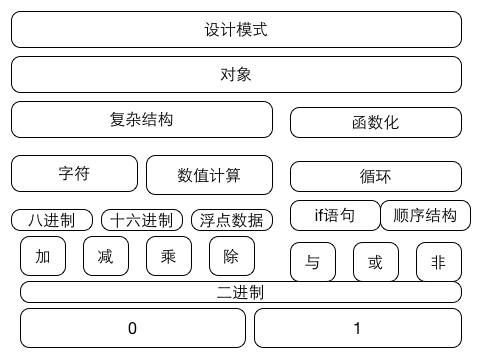

#有序构建之基本方法篇

在第一篇[《有序构建》](http://km.oa.com/group/21772/articles/show/209070)中，我们提出了一种构建程序的理念——有序构建。所谓有序构建即是：有序构建是在一定的资源基础上通过一些列不同的策略和行为利用构建特定用途软件（代码、程序）的过程。其实这个概念所说的事情，极度简单，说白一点就是写程序的时候一定要按照一定的规则来。但是知道了这一点，我们一方面能够实现构建软件并增强软件的可维护性和稳定性，另外一方面可以通过掌握更多的“规则”来扩展自己的编程技能。上一篇文章中，着重从后者阐述了一下：OC中一些问题从不同的方向去看去解决。而这篇文章将探讨另一个话题：有序构建的基本方法。或者说我们在解决编程问题的时候的的那些最基本的规则是什么。并且视图解释在构建产品型项目的过程中可以使用的一种规则：构建简单可依赖的基础元素，然后通过基础元素的叠加来实现功能，在需求变更或者新需求到达的时候，首先尝试通过已有的基础元素的组合来满足需求，不能满足的时候，或者修改已有的元素或者构建新的元素，如此往复，构建出复杂的软件系统。

目前市面上看到的大多架构类书籍，着重与阐述分析与设计阶段。而后续的“构建”阶段，往往被认为是设计阶段的附属物——诚然如此。不错，似乎在构建阶段也有着一些独特的方法。而我们则试图去寻找这里面的一点东西。

同时，建议看一下[关于程序设计和思维的思考](http://km.oa.com/group/22128/articles/show/185307)。

##自顶向下分析，自下而上构建
我们先回顾一个小学六年级的算术题目：计算阴影面积

做这道题目的时候，我们会首先对问题进行分解，看到这个阴影其实是通过对三个基本图形叠加互相遮盖制造出来的，那么现在的问题就从计算阴影面积的一个大问题，变成了计算三个基本图形的面积的问题。

这是一个非常典型的自顶向下分析的过程，把大问题逐步细分成小问题，找到如何去解决问题。

而我们在计算，去解决这个问题的时候，却成了这样：

在解决问题的时候，我们是从子问题开始解决，然后通过已经解决掉的子问题来构建出了大问题的答案。

举这个例子实际上是为了类比于我们在处理编程问题的时候的一些思路和做法。以前学的软件工程或者任何一本讲架构的书，都事无巨细的把问题的分析过程和基本方法讲的很透彻。而自顶向下的程序设计也是我们从一开始接触编程开始就被灌输的理念。

然而当我们真正开始的coding的时候，我们是从下往上去构建的。非常典型的是网络的七层模型，下层协议为上层协议提供基础，上层协议又为更上层协议提供基础。。。。在这样的一种关系下构建出了整个的网络体系。

首先有了物理层，才能在其之上去构建数据链路层。这才是我们真实的构建顺序，现有基础，才能构建上层功能。现有地基才能往上添砖加瓦（BDD和TDD的顺序可能有些时候是不是如此，比如TDD先写测试用例，而后去实现功能，其实，在我看来这是把一部分分析工作移到了构建过程中）。既然构建的方向和我们思考的方向，恰恰相仿。那么构建必然会有其独特的地方和方法。

###架构
架为设计，构为构建。我们是否可以尝试放弃一些控制，不在从一个高大的“架构”层面思考问题，而是从最基础的代码和构建开始，通过遵循一些简单而可重复的规则，让我们写的每一个函数每一个类都“简单可依赖”，通过明确我们所使用的规则，在软件的不断迭代中，构建出高度复杂同时也同样高度可维护性的代码。

从架构的层次思考问题，很多时候我们很难去解决需求变更，产品变化等等问题。只能说“这个架构在最近几个版本之内能够支撑业务增长”。因为我们试图去创造一个可以控制一切的东西，将未来那些不可预期的变化都预知到。而这正是问题所在，那些不可预期的变化，既然你不知道，那么又怎么能够创造出能够提前解决他们的方案呢？那么换个角度，我们不试图去占卜未来的变化，而只是把当下的代码做的能够适应变化，那么即使未来发生变化，我们的代码不是也能够有效的处理问题吗？

##逻辑与抽象
从开始干coding monkey开始就一直听各种人说：数学基础对于编程能力很重要。但是，为什么？

> 数学（Mathematics）是利用符号语言研究数量、结构、变化以及空间等概念的一门学科，从某种角度看属于形式科学的一种。数学透过抽象化和逻辑推理的使用，由计数、计算、量度和对物体形状及运动的观察而产生。数学家们拓展这些概念，为了公式化新的猜想以及从选定的公理及定义中建立起严谨推导出的定理。
> ——WIKI（[数学](http://zh.wikipedia.org/wiki/%E6%95%B0%E5%AD%A6)）

这个定义来自于WIKI关于数学的定义。在这个定义中我们貌似看到了我们某些编程上的东西，比如符号语言（看过编译原理之类的书的话，大概还能联想起一型文法和二形文法之类的来）。在比如“抽象”这不是类似于OOP这类的编程范式一直在强调的东西嘛。还有“逻辑”这个词难道不是我们在编程的时候一直挂在嘴边的东西？

数学之于编程在于能力的培养而非具体方法的指导。而其中的两种能力最为关键：逻辑与抽象。

##逻辑：真与假 (二分)

###从基础开始
> 易有太极，是生两仪，两仪生四象，四象生八卦
> ——《易传》

事物的演化总有一定的规律——由简而繁。古人说“两仪生四象”，从对立的阴阳两面而衍生出四象，四象又衍生出八卦.......这说了一个由简而繁的过程。而且演变的一个基础即是“两仪”——对立的两面。反过来想想以前学的计算机基础，貌似所有存储的最底层都是“0”与“1”，这对立的两个数字。在逻辑中我们说这是真和假。如果我们要判断一个命题的成立与否，这是最小的进制——二进制。我们使用二进制，将一连串的真真假假、假假真真串联在一起构建出了更加复杂的操作系统和软件。即使我们现在我们在Coding的时候，碰到最多的还是if语句的真值判断（循环语句也可以退化成if语句）。如果我们换个角度，以真与假为最基本的构建元素，似乎能够构建出当前编程的一个大致框架:

这是一个有意思的角度，0与1是构建整个程序世界的砖瓦泥。而且他们在程序世界的各个层面中都担当者举足轻重的作用。比如拿语言来说，无论你是使用机器语言，还是低级的汇编语言，还是高级的C++，亦或者现代的Ruby，你能够避开if语句的真值判断吗？很明显不能够。因为真值判断是最基本最基础的东西。

而真值判断做为基本的规则，将会贯穿在整个程序设计的各个层次当中。从有序构建的解读来讲，最基础的一个规则就是“真与假”的逻辑。

###分而治之
其实很多时候，我们面对的问题并没有我们想想的那么复杂和难以解决。只不过是我们自己把问题想复杂了，导致自己很长时间解决不了问题。那些庞大的问题，往往可以细分成小问题。而当问题规模相对较小的时候，解决起来也相对简单。当小问题解决之后，我们再拿着解决掉的小问题，去解决原来的大问题。那么看似庞大的问题，则可以迎刃而解。而这个过程中，往往但从解决问题的层面去考虑的话，单纯解决小问题的思路和单纯解决大问题的思路在很多地方是类似的。

###通过抽象，制造基础素材

###简单可依赖
我们先尝试解决一个问题，就是传统项目型工程和现在的产品型工程的最大区别在什么地方？我想应该是“愿景是否清晰”。往往项目型的工程，能够有足够的时间进行需求分析，概念设计，详细设计和架构设计等等，而且他们有明确的“愿景”，工程的规模大概多大，需求方都有哪些要求（虽然也会有变更，但大体已定）。而对于产品型的项目呢？则不尽相同，往往只有一个版本或者几个版本内的需求规划，很少能有人能够预知整个工程在遥远的未来将会演变成的样子，所以将会面对无穷无尽的需求变更，而且往往每个版本的时间都很紧张，没有足够的时间按照传统项目的方法去做需求分析和架构设计。既然，项目型工程和产品型工程存在这些差异。那么，是否项目型工程在构建的过程中需要一些特别的方法？

我们很喜欢用建筑类比于软件工程。那么我们先从一个问题开始：谁建造了城市？

建筑工程中有两种非常鲜明的角色，一个是建筑师，一个是搬砖的普通工人。如果问这两种人谁牛逼，大概我们想都不想的说建筑师牛逼。这个完全像问架构师和码农谁牛逼一样。大家都认为架构师牛逼，因为架构师设计了整个工程的蓝图。而码农只不过是一群找着蓝图施工的人罢了。对于传统的项目型工程可能的确是这个样子，但是对于产品型的工程就不见得了，我们很少能见到一些牛逼的结构式，反而是见到了很多牛逼的码农。他们往往是在没有明确的架构指导下，构建出了一个个大型的产品。拿我做手Q的经验来看，我几乎没有见到过一个完整的手Q框架图，见到最多的是对于某些问题的具体分析和解决方案。有人为了解决网络通信的问题做了MSF，有人为了解决结构化数据存储的问题封装了SQLIte存储，有人为了解决JS调用繁多的问题做了WebView的插件机制.........

###函数式编程

###红点系统，由类型向配置过度

##抽象：变与不变
如果说用一句话来总结抽象的作用，我想这句话应该是：封装变化。把抽象用到最好的一种编程范式应该是OOP（面向对象编程范式）了吧。在OOP的设计思想体系中有一个根基是六大基本原则：

1. 单一职责原则  
      定义：就一个类而言，应该仅有一个引起它变化的原因。如果一个类承担的职责过多，就等于把这些职责耦合在一起，一个职责的变化可能会削弱或抑制这个类完成其它职责的能力。  
      理解：不求面面俱到，只做一件事。
2. 开放封闭原则  
      定义：对于扩展是开放的，对于更改是封闭的。就是说软件实体（类、模块、函数等等）应该可以扩展，但是不能修改。软件开发和维护过程中代码的修改是很危险的一件事，应该避免。实现开放封闭原则的关键就是抽象。  
      理解：变化也是可以预测的，变化也需要被管理。
3. 依赖倒转原则  
       定义：高层模块不应该依赖底层模块，两个都应该依赖抽象；抽象不应该依赖细节，细节应该依赖抽象。依赖倒转原则是开放封闭原则实现的手段，是抽象的最好规范。要针对接口编程，不能针对功能和过程编程。
       理解：电厂应该根据电线和变压器来设计电压强度，而不是根据手机、电视等用电器来设计电压强度；
4. 里氏代换原则  
       定义：子类型必须能够替换掉它们的父类型。也就是一个软件实体如果使用的是一个父类的话，那么一定适用于其子类，父类替换子类后，程序的行为不会发生变化。只有当子类可以替换掉父类，软件单位的功能没有受到影响时，父类才能真正被复用，而子类也能够在父类的基础上增加新的行为。
       理解：“动物”可以代表“人”，“人”不能代表“动物”。
5. 迪米特法则  
      定义：如果两个雷不能彼此直接通信，那么这两个类就不应当发生直接的相互作用。如果其中一个类需要调用另一个类的某一个方法的话，可以通过第三者转发这个调用。迪米特法则的思想，时强调了类之间的松耦合，类之间的耦合越弱，越有利于复用。一个处在弱耦合的类被修改，不会对有关系的类造成波及。  
       理解：迪米特法则讲的不就是现实社会的“中介”吗？
6. 接口隔离原则  
定义：使用多个专门的接口比使用单一的总接口要好。一个类对另外一个类的依赖性应当是建立在最小接口上的。如果没有关系的接口合并在一起，将会形成一个臃肿的大接口。  
        理解：每个人都应该有自己特定的电话号码，不能多个人拥有同一个电话号码。
        
这六个基本原则表面上看说的是类和类之间的关系，其实实质上说的是类合入处理变化。比如单一职责说的是一个类的职责要纯粹，不要承担过多的责任，该是其他类承担的责任不要盲目的去承担。而且这一原则特别强调变化，能够引起类变化的原因越少越好，最好少到只有一个。而开放封闭原则，则非常直白的强调了，对于扩展开放，对于变化封闭。

**变化**这个东西在我们使用抽象这一工具的过程中举足轻重，那么问题来了，什么是变化？

迭代是通过直接修改原有的组件和代码，来满足新的产品需求。
而组合是通过，使用原有的代码和组件，并结合新的功能要求，对其进行组合来满足新的产品需求。

迭代往往会对原有的代码结构产生破坏和一些副作用，而组合是在尽量不动原有代码结构的前提下来构建新的代码。

这是一个以小博大的游戏。

原子性，能够在某个概念层次独立完成特定功能的特性。
原子性的本意是指，最小的不可分割的单元。

投过变与不变的二元思考，来拆分功能的原子单元。

把编程看成是构建一个语言系统的过程，通过构建不同概念层次的可操作原子单元并结合特定的构建规则，来实现服务目标。

构建规则可以分成两类：迭代类和组合类。

解决问题的能力=大脑的思考速度+对当前问题的了解程度+知识边界

关系就是对于原子单元的“操作”，那么问题来了，最小的关系单元是什么，而且都有哪些关系

有关系 — 什么关系。。。UML中定义的基本关系 泛化（Generalization）,  实现（Realization），关联（Association)，聚合（Aggregation），组合(Composition)，依赖(Dependency)

没有关系

原子单元只完成自己的功能，当他们之间依照简单的关系来组合的时候，往往会“涌现”（凯文凯利《失控》）出更高级的功能这些功能甚至是你之前无法预期到的。

功能是构建的副作用，而我们在构建整个程序的时候，注重的往往是这些“副作用”。

##工具

###PIN箱
用于概念收拢
###Cocoapods
IOS中的lib管理工具